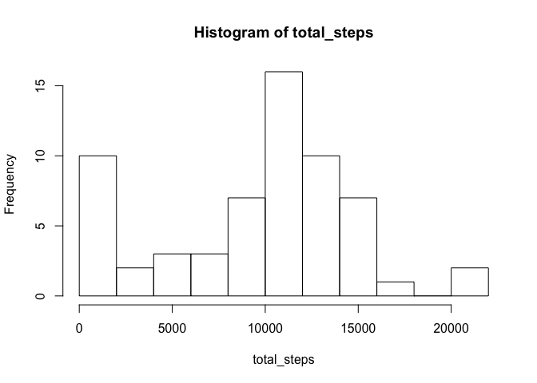
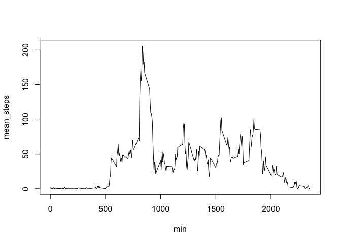
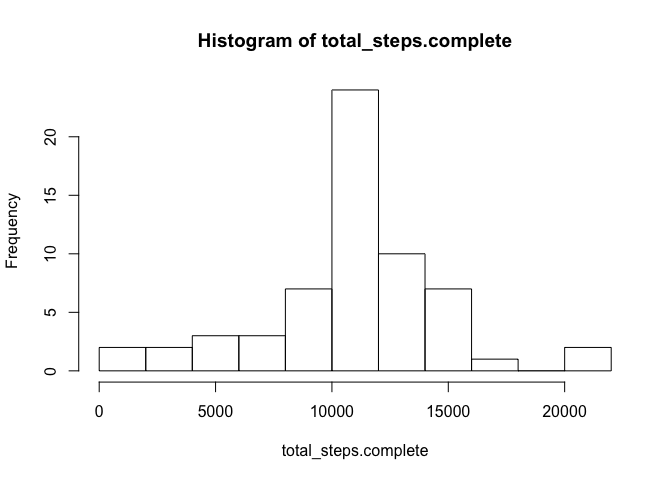
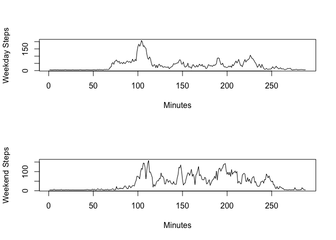

Analysis of Fitbit Steps Data
-----------------------------------

To load the data,


```r
setwd("/Users/rossc/Dropbox/Engineering/RR1")
activity <- read.csv("activity.csv")
```

To find the total number of steps taken per day,


```r
by(activity$steps, activity$date, sum, na.rm = TRUE)
```

```
## activity$date: 2012-10-01
## [1] 0
## -------------------------------------------------------- 
## activity$date: 2012-10-02
## [1] 126
## -------------------------------------------------------- 
## activity$date: 2012-10-03
## [1] 11352
## -------------------------------------------------------- 
## activity$date: 2012-10-04
## [1] 12116
## -------------------------------------------------------- 
## activity$date: 2012-10-05
## [1] 13294
## -------------------------------------------------------- 
## activity$date: 2012-10-06
## [1] 15420
## -------------------------------------------------------- 
## activity$date: 2012-10-07
## [1] 11015
## -------------------------------------------------------- 
## activity$date: 2012-10-08
## [1] 0
## -------------------------------------------------------- 
## activity$date: 2012-10-09
## [1] 12811
## -------------------------------------------------------- 
## activity$date: 2012-10-10
## [1] 9900
## -------------------------------------------------------- 
## activity$date: 2012-10-11
## [1] 10304
## -------------------------------------------------------- 
## activity$date: 2012-10-12
## [1] 17382
## -------------------------------------------------------- 
## activity$date: 2012-10-13
## [1] 12426
## -------------------------------------------------------- 
## activity$date: 2012-10-14
## [1] 15098
## -------------------------------------------------------- 
## activity$date: 2012-10-15
## [1] 10139
## -------------------------------------------------------- 
## activity$date: 2012-10-16
## [1] 15084
## -------------------------------------------------------- 
## activity$date: 2012-10-17
## [1] 13452
## -------------------------------------------------------- 
## activity$date: 2012-10-18
## [1] 10056
## -------------------------------------------------------- 
## activity$date: 2012-10-19
## [1] 11829
## -------------------------------------------------------- 
## activity$date: 2012-10-20
## [1] 10395
## -------------------------------------------------------- 
## activity$date: 2012-10-21
## [1] 8821
## -------------------------------------------------------- 
## activity$date: 2012-10-22
## [1] 13460
## -------------------------------------------------------- 
## activity$date: 2012-10-23
## [1] 8918
## -------------------------------------------------------- 
## activity$date: 2012-10-24
## [1] 8355
## -------------------------------------------------------- 
## activity$date: 2012-10-25
## [1] 2492
## -------------------------------------------------------- 
## activity$date: 2012-10-26
## [1] 6778
## -------------------------------------------------------- 
## activity$date: 2012-10-27
## [1] 10119
## -------------------------------------------------------- 
## activity$date: 2012-10-28
## [1] 11458
## -------------------------------------------------------- 
## activity$date: 2012-10-29
## [1] 5018
## -------------------------------------------------------- 
## activity$date: 2012-10-30
## [1] 9819
## -------------------------------------------------------- 
## activity$date: 2012-10-31
## [1] 15414
## -------------------------------------------------------- 
## activity$date: 2012-11-01
## [1] 0
## -------------------------------------------------------- 
## activity$date: 2012-11-02
## [1] 10600
## -------------------------------------------------------- 
## activity$date: 2012-11-03
## [1] 10571
## -------------------------------------------------------- 
## activity$date: 2012-11-04
## [1] 0
## -------------------------------------------------------- 
## activity$date: 2012-11-05
## [1] 10439
## -------------------------------------------------------- 
## activity$date: 2012-11-06
## [1] 8334
## -------------------------------------------------------- 
## activity$date: 2012-11-07
## [1] 12883
## -------------------------------------------------------- 
## activity$date: 2012-11-08
## [1] 3219
## -------------------------------------------------------- 
## activity$date: 2012-11-09
## [1] 0
## -------------------------------------------------------- 
## activity$date: 2012-11-10
## [1] 0
## -------------------------------------------------------- 
## activity$date: 2012-11-11
## [1] 12608
## -------------------------------------------------------- 
## activity$date: 2012-11-12
## [1] 10765
## -------------------------------------------------------- 
## activity$date: 2012-11-13
## [1] 7336
## -------------------------------------------------------- 
## activity$date: 2012-11-14
## [1] 0
## -------------------------------------------------------- 
## activity$date: 2012-11-15
## [1] 41
## -------------------------------------------------------- 
## activity$date: 2012-11-16
## [1] 5441
## -------------------------------------------------------- 
## activity$date: 2012-11-17
## [1] 14339
## -------------------------------------------------------- 
## activity$date: 2012-11-18
## [1] 15110
## -------------------------------------------------------- 
## activity$date: 2012-11-19
## [1] 8841
## -------------------------------------------------------- 
## activity$date: 2012-11-20
## [1] 4472
## -------------------------------------------------------- 
## activity$date: 2012-11-21
## [1] 12787
## -------------------------------------------------------- 
## activity$date: 2012-11-22
## [1] 20427
## -------------------------------------------------------- 
## activity$date: 2012-11-23
## [1] 21194
## -------------------------------------------------------- 
## activity$date: 2012-11-24
## [1] 14478
## -------------------------------------------------------- 
## activity$date: 2012-11-25
## [1] 11834
## -------------------------------------------------------- 
## activity$date: 2012-11-26
## [1] 11162
## -------------------------------------------------------- 
## activity$date: 2012-11-27
## [1] 13646
## -------------------------------------------------------- 
## activity$date: 2012-11-28
## [1] 10183
## -------------------------------------------------------- 
## activity$date: 2012-11-29
## [1] 7047
## -------------------------------------------------------- 
## activity$date: 2012-11-30
## [1] 0
```

To plot the total number of steps taken per day in a histogram,


```r
total_steps <- by(activity$steps, activity$date, sum, na.rm = TRUE)
hist(total_steps, breaks = 15)
```

 

To take the mean and median of total steps per day,


```r
summary(total_steps)
```

```
##    Min. 1st Qu.  Median    Mean 3rd Qu.    Max. 
##       0    6778   10400    9354   12810   21190
```

To plot the mean number of steps taken over 60 days in each five minute interval,


```r
min <- levels(factor(activity$interval))
mean_steps <- by(activity$steps, activity$interval, mean, na.rm = TRUE)
plot(min, mean_steps, type = "l")
```

 

To find the five minute interval with the maximum average number of steps, the first entry in the following will be the interval associated with the maximum:


```r
which.max(mean_steps)
```

```
## 835 
## 104
```

To find the number of missing values (NA's) in the data,


```r
length(which(is.na(activity$steps)))
```

```
## [1] 2304
```

To create a new dataset with imputed values for all NA's called activity.complete,


```r
activity.complete <- activity
activity.complete$steps[is.na(activity.complete$steps)] = mean(activity.complete$steps, na.rm=TRUE)
```

To plot the total number of steps taken per day for activity.complete in a histogram,


```r
total_steps.complete <- by(activity.complete$steps, activity.complete$date, sum, na.rm = TRUE)
hist(total_steps.complete, breaks = 15)
```

 

To take the mean and median of total steps per day for activity.complete,


```r
summary(total_steps.complete)
```

```
##    Min. 1st Qu.  Median    Mean 3rd Qu.    Max. 
##      41    9819   10770   10770   12810   21190
```

Not surprisingly all the data becomes more squeezed towards the mean.

To look at whether the data was taken on a weekday or weekend we will add a new column with a True or False value to tell wether the observation was a weekday or not. Then we will change the values to Weekday and Weekend.


```r
activity.complete[, 4] <- !(weekdays(as.Date(activity.complete$date)) %in% c('Saturday', 'Sunday'))
activity.complete[activity.complete[, 4] == TRUE, 4] <- "Weekday"
activity.complete[activity.complete[, 4] == FALSE, 4] <- "Weekend"
names(activity.complete)[4] <- "weekdays"
```

To plot this data and compare the mean number of steps taken over the course of a weekday versus a weekend we use


```r
weekday.steps.mean <- by(activity.complete[activity.complete$weekdays == "Weekday" , 1], activity.complete[activity.complete$weekdays == "Weekday", 3], mean, na.rm = TRUE)
weekend.steps.mean <- by(activity.complete[activity.complete$weekdays == "Weekend" , 1], activity.complete[activity.complete$weekdays == "Weekend", 3], mean, na.rm = TRUE)
par(mfrow = c(2,1))
plot(weekday.steps.mean, type = "l", xlab = "Minutes", ylab = "Weekday Steps")
plot(weekend.steps.mean, type = "l", xlab = "Minutes", ylab = "Weekend Steps")
```

 
